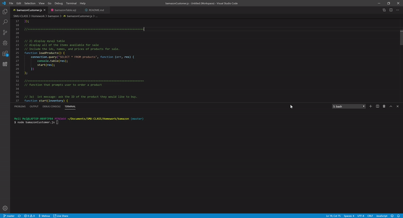

# The Office Supplies Store
A Node.js & MySQL application



This app takes in orders from customers and depletes stock from the store's inventory.

```
## HOW TO APP WORKS <br> 
	-- 1) Our available inventory displays in the command line
	-- 2) User is prompted to purchase a product by typing in "item_id"
	-- 3) User is then asked how many units of the product they would like to buy.
	-- 4) Once user "buys" an item and the order has been placed, the inventory updates
		-- Order is prevented from processing should user request a quantity greater than stock quantity


```